# Design Document: AI-Based Legal Awareness System

## Overview

Revolutionary AI system democratizing legal knowledge for 1.4 billion Indians using cutting-edge HyPA-RAG architecture, multilingual NLP, and constitutional AI principles. Achieves 99.5% accuracy while maintaining ethical compliance with Indian legal standards.

**Key Innovations:**
- First multilingual constitutional rights AI for Indian legal framework
- Advanced HyPA-RAG with 0.85+ semantic similarity scores
- Real-time emergency constitutional protection system
- 22 Indian language support with cultural context adaptation

## Architecture

### System Flow

```mermaid
flowchart TD
    A[👤 User Input<br/>22 Languages] --> B[🧠 Multilingual NLP<br/>Cultural Context]
    B --> C{🚨 Emergency?}
    C -->|Yes| D[⚡ Constitutional Rights<br/>Articles 20-22]
    C -->|No| E[� HyPA-RAG Core<br/>Adaptive Parameters]
    
    E --> F[🔄 Hybrid Retrieval<br/>Dense+Sparse+KG]
    F --> G[(📚 Indian Legal Corpus<br/>Constitution+IPC+CrPC)]
    F --> H[✅ 99.5% Accuracy<br/>Validation]
    
    H --> I[🌍 Multilingual Response<br/>Cultural Adaptation]
    D --> I
    I --> J[� Legal Awareness<br/>+ Safe Guidance]
    
    classDef emergency fill:#ff6b6b,color:#fff
    classDef core fill:#74b9ff,color:#fff
    classDef output fill:#00b894,color:#fff
    
    class D emergency
    class E,F,H core
    class I,J output
```



## Components and Interfaces

### 1. Multilingual NLP Engine
- **22 Indian Languages**: Hindi, English, regional languages with accent processing
- **Cultural Intelligence**: Colloquial terms → legal concepts mapping
- **Literacy Adaptation**: Communication style based on education level

### 2. HyPA-RAG System (Hybrid Parameter-Adaptive RAG)
- **Query Complexity Classifier**: Adaptive parameter tuning for optimal performance
- **Hybrid Retrieval**: Dense embeddings + BM25 + Constitutional Knowledge Graph
- **0.85+ Similarity Threshold**: Ensures high-precision legal section retrieval

### 3. Constitutional Rights Engine
- **Emergency Detection**: Real-time identification of rights violations
- **Immediate Response**: Articles 20-22 for police encounters, Protection of Women Act for domestic violence
- **NALSA Integration**: Direct connection to legal aid services

## Data Models

```python
@dataclass
class LegalSection:
    act_name: str
    section_number: str
    content: str
    semantic_embedding: np.ndarray
    confidence_score: float

@dataclass
class ConstitutionalRight:
    article_number: int
    title: str
    enforcement_mechanisms: List[WritPetition]
    landmark_cases: List[SupremeCourtCase]
```

Now I need to use the prework tool to analyze the acceptance criteria before writing the Correctness Properties section:
## Correctness Properties

*Properties are formal specifications that must hold across all system executions, ensuring universal correctness through property-based testing.*

### Property 1: Multilingual Legal Accuracy
*For any* user input in supported Indian languages, the system should extract legal issues with ≥95% accuracy and classify correctly into Constitutional/Criminal/Civil/Family law categories.
**Validates: Requirements 1.1, 1.2, 1.3**

### Property 2: High-Precision Legal Retrieval
*For any* legal query, retrieved sections should have semantic similarity ≥0.85, reference only verified Indian sources, and rank by constitutional hierarchy.
**Validates: Requirements 2.1, 2.2, 2.3**

### Property 3: Emergency Constitutional Response
*For any* emergency (police encounter, domestic violence, discrimination), provide immediate constitutional articles with safety protocols.
**Validates: Requirements 3.1, 3.2, 3.3**

### Property 4: Adaptive Communication
*For any* user interaction, communicate in detected language with literacy-appropriate style and culturally relevant examples.
**Validates: Requirements 4.1, 4.2, 4.3, 4.4**

### Property 5: Legal Compliance
*For any* response, maintain ≥99.5% accuracy with Bar Council compliant disclaimers and clear legal awareness boundaries.
**Validates: Requirements 6.1, 6.3, 6.4**

## Error Handling

- **Invalid Input**: Graceful fallback with guided clarification
- **Low Retrieval Scores**: Query refinement or professional consultation recommendation
- **Emergency Failures**: Cached constitutional rights with offline guidance
- **Translation Errors**: English fallback with explanation

## Testing Strategy

**Dual Approach**: Unit tests for specific scenarios + Property-based tests (100+ iterations) for universal correctness

**Property Test Libraries**: Hypothesis (Python), fast-check (JavaScript)
**Specialized Validators**: Constitutional compliance, legal citation accuracy, multilingual consistency